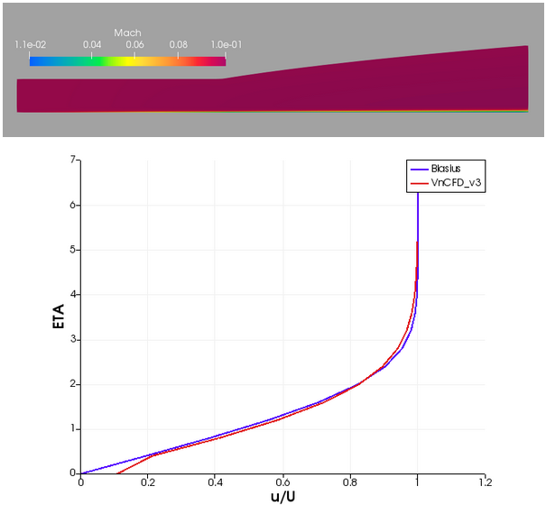

# Thực hành CFD với Python! VnCFD_2D_v3!

**VnCFD_2D_v3** là chương trình mô phỏng dòng chảy khí lý tưởng hoặc khí thực trong không gian hai chiều, là hiện thực hóa các kiến thức được giới thiệu trong khóa học **Thực hành CFD với Python!** (hiện tại đã có 4 phần). Các phần của khóa học này được viết song song với các phiên bản của VnCFD_2D, tất cả được public [tại đây](https://github.com/SangVn).

[Hướng dẫn sử dụng](https://nbviewer.jupyter.org/github/SangVn/VnCFD_2D_v3/blob/master/Tutorial.ipynb) 

